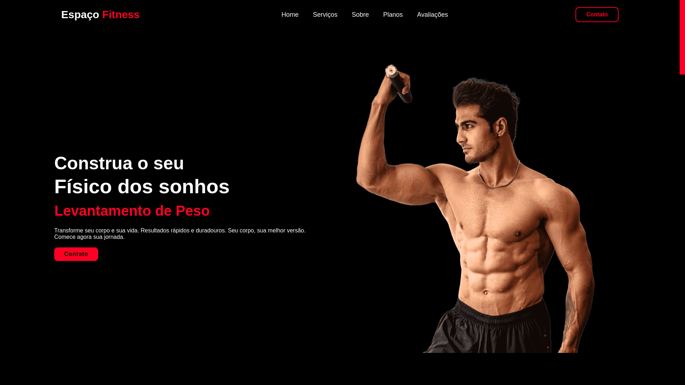

🚀 Projeto: Landing-page para Academia

Bem-vindo ao repositório da Espaço Fitness, uma landing-page projetada para academias. Este projeto foi desenvolvido como um tutorial prático para criar páginas responsivas e interativas, usando tecnologias modernas da web.

<h1 align="center">  </h1>

🎯 Motivação

A ideia deste projeto surgiu da necessidade de criar uma página simples, elegante e funcional para academias divulgarem seus serviços online. Além de ser uma prática útil de desenvolvimento front-end, ele serve como base para iniciantes explorarem HTML, CSS e JavaScript em um cenário real.

Assista ao tutorial completo no meu canal do YouTube e veja como foi o processo de criação dessa landing-page!

<p align="center"> <a href="https://www.youtube.com/watch?v=rFM5KWuKiYY&t=6201s" target="_blank">  </a> </p>

💻 Pré-requisitos

Antes de começar, certifique-se de ter as seguintes ferramentas instaladas em sua máquina:

Node.js
Yarn

🛠️ Como instalar e executar o projeto

## 🚀 Instalando

Primeiro, você deve clonar o projeto na sua máquina, para isso você
pode colar o seguinte comando em seu terminal

```bash
git clone https://github.com/Tiago-Silva/espaco-fitness-02.git
```
Para instalar as dependências, execute o seguinte comando:

```bash
yarn install
```

O projeto é em apenas Html, Css e javascript, então abra o arquivo no seu navegador

✨ Tecnologias utilizadas

Este projeto foi desenvolvido utilizando as seguintes tecnologias e ferramentas:

<p align="center"> <a href="https://skillicons.dev">  </a> </p>

📺 Vídeo do tutorial

Para acompanhar o processo de criação passo a passo, acesse o vídeo no meu canal do YouTube:

<p align="center"> <a href="https://www.youtube.com/watch?v=rFM5KWuKiYY&t=6201s" target="_blank">  </a> </p>

📝 Licença

Este projeto está licenciado sob a licença MIT. Consulte o arquivo LICENSE para obter mais informações.

Sinta-se à vontade para contribuir ou deixar uma estrela ⭐ se este projeto foi útil para você!
